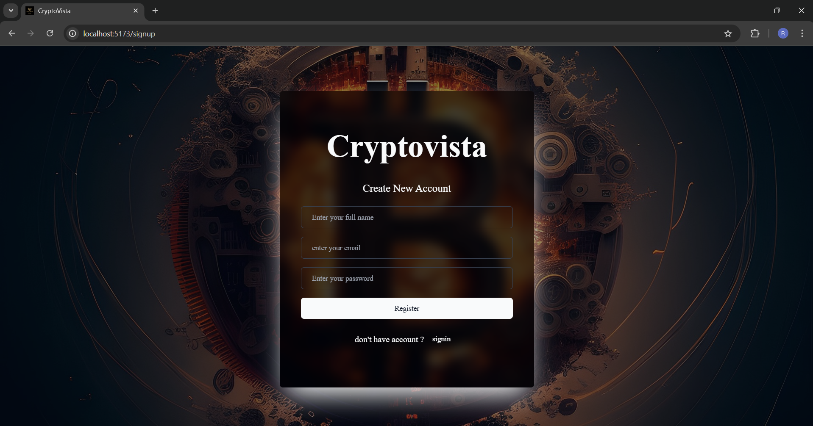
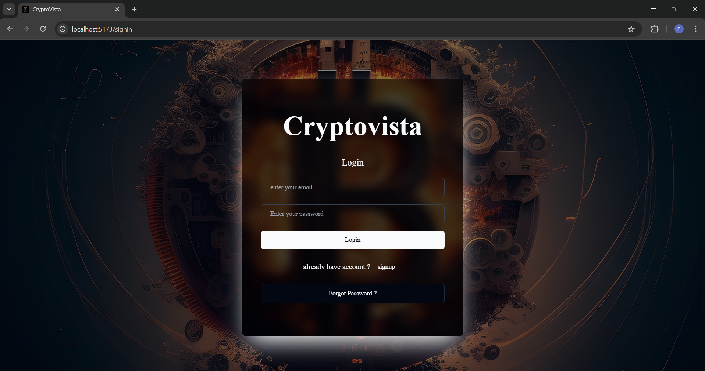
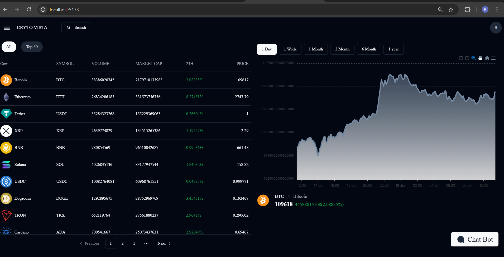
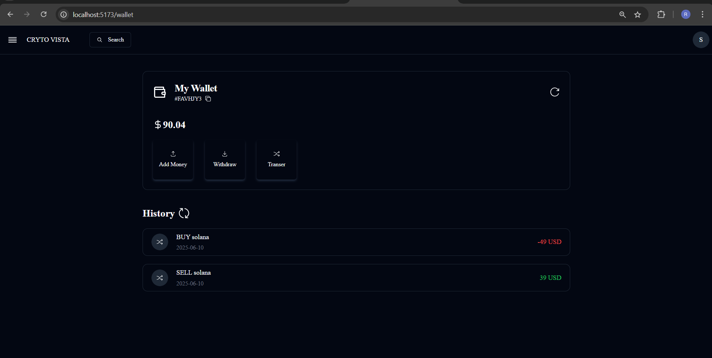
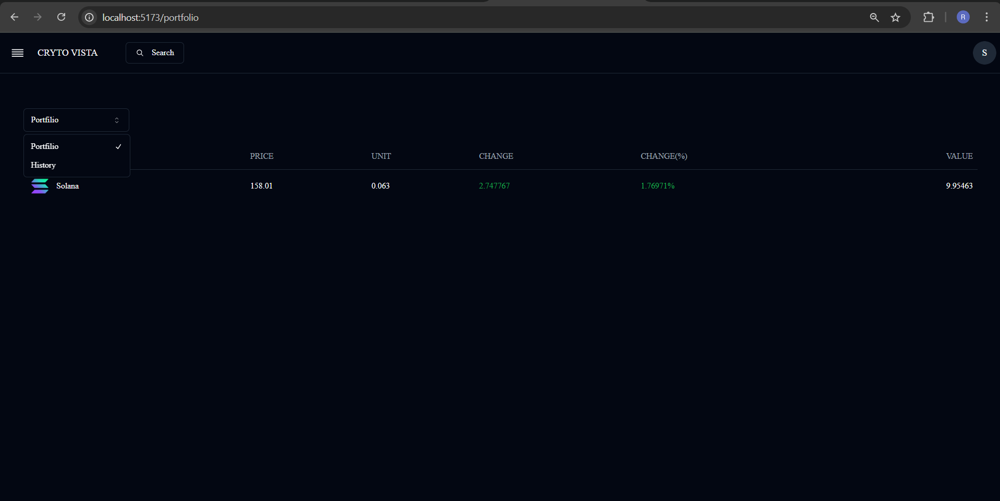

# 🚀 CryptoVista – Cryptocurrency Trading Platform

A beginner to intermediate full-stack cryptocurrency trading platform built with **React**, **TailwindCSS**, **Spring Boot**, **MySQL**, and third-party APIs like CoinGecko and Gemini. The app supports real-time crypto data, wallet management, order placement, payments, and even AI chatbot interaction.

---

## 🔍 Overview

CryptoVista offers users a secure and responsive environment to:

* 🔐 Sign up / log in securely using JWT + Spring Security
* 📈 View live market data for hundreds of cryptocurrencies
* 👛 Manage wallets and track individual assets
* 📊 Buy/sell coins using simulated orders
* 💳 Pay via Razorpay/Stripe
* 🤖 Ask questions to an AI-powered chatbot (Gemini-based)
* 🔄 Perform wallet-to-wallet transactions (on-chain concept)

---

## 🚀 Features

* 🔐 Secure Login & JWT Authentication
* 📈 Real-Time Market Data from CoinGecko & Gemini APIs
* 🪙 Buy/Sell Orders with OrderType (BUY/SELL)
* 💼 Portfolio View by Logged-In User
* 👛 Wallet & Transaction Management
* 🤖 AI Chatbot for User Support (Gemini integrated)
* 📲 Responsive UI using React + Tailwind CSS + ShadCN
* 💳 Razorpay & Stripe Integration for Payments
* 🧾 Order History & Wallet History by User
* 📊 Crypto Chart Visualizations
* 🌍 Exportable Coin & Portfolio Data (CSV/Excel coming soon)

---

## 🧩 Folder Structure & Modules

### Backend (Spring Boot)

* `model/` - Java classes like CoinDTO, Asset, WalletTransaction
* `repository/` - Repositories like `AssetsRepository`, `OrderRepository`
* `controller/` - REST APIs for coins, orders, wallets, auth
* `request/` - Request DTOs like `CreateOrderRequest`
* `service/` - Service layer for business logic
* `security/` - JWT-based Spring Security configuration

### Frontend (React)

* `pages/` - Pages like Dashboard, Orders, Portfolio
* `components/` - UI Components for Header, CoinCard, etc.
* `redux/` - State Management for user, coins, wallets
* `api/` - Axios-based service for API calls
* `assets/` - Icons, images, logo

---

## 🔄 State Management

* Frontend uses Redux Toolkit to manage state:

  * User Auth & Tokens
  * Coin List / Prices
  * Wallet & Order Data
* Backend uses Spring layers for logic separation
* Repositories act as DAO (Data Access Object) between DB and services

---

## 📸 Final Output Screenshots

## 📸 Final Output Screenshots

### 🧾 Signup Page



### 🔐 Login Page



### 🏠 Home Page (Dashboard)



### 🛠️ Features Panel


### 👛 Wallet Page



### 📊 Portfolio View



---

## ⚙️ Setup Instructions

1. Clone the repository

```bash
git clone https://github.com/your-username/cryptovista.git
```

2. Backend Setup

```bash
cd backend
./mvnw spring-boot:run
```

3. Frontend Setup

```bash
cd frontend
npm install
npm start
```

> Ensure `.env` file includes keys for CoinGecko, Gemini, Stripe, Razorpay.

---

## 🙌 Credits

Created with ❤️ by Rohit Dhumal and team Cryptovista.
Special thanks to:

* 🪙 CoinGecko & Gemini for crypto APIs
* 🤖 Gemini AI for Chatbot
* 💳 Stripe & Razorpay for payments

---

## 📄 License

This project is licensed under the MIT License.
Feel free to fork and enhance CryptoVista!
